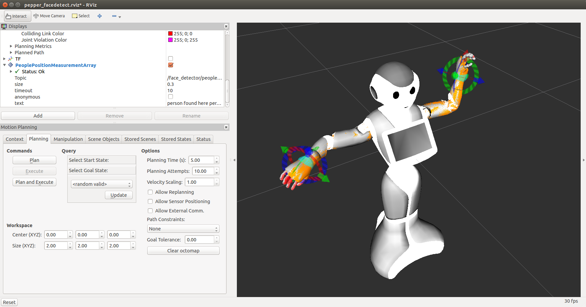

Pepper ROS application
----------------------------------

.. contents:: Table of Contents
   :depth: 2
.. sectnum::

install (from source)
------------------------

TBD

Tentative operation and run for Nov 2015 (for TORK)
--------------------------------------------------------------------------------

install
=======

Following is a tentative source installation (for Nov 2015 project at TORK). ::

  mkdir -p ~/cws_naoqi/src && cd ~/cws_naoqi/src
  git clone https://github.com/tork-a/pepper_robot.git && cd pepper_robot && git checkout add/app_pkg
  wstool init && wstool merge pepper_robot/pepper_app/.rosinstall
  cd ~/cws_naoqi
  catkin init
  rosdep install --from-paths src --ignore-src
  catkin build
  source devel/setup.bash

Run
=======

The following has been only verified on virtual environment (where `Choregraphe` is not present).

Run with MoveIt!
++++++++++++++++++++

::

  roslaunch pepper_app pepper_facedetect_moveit.launch 
  

Run without MoveIt!
++++++++++++++++++++

If you have not installed naoqi python SDK, MoveIt! may not run. In this case, run the following. 
Note that the robot model may not appear on RViz unless you start ROS naoqi bridge successfully:

::

  roslaunch pepper_app pepper_facedetect.launch
